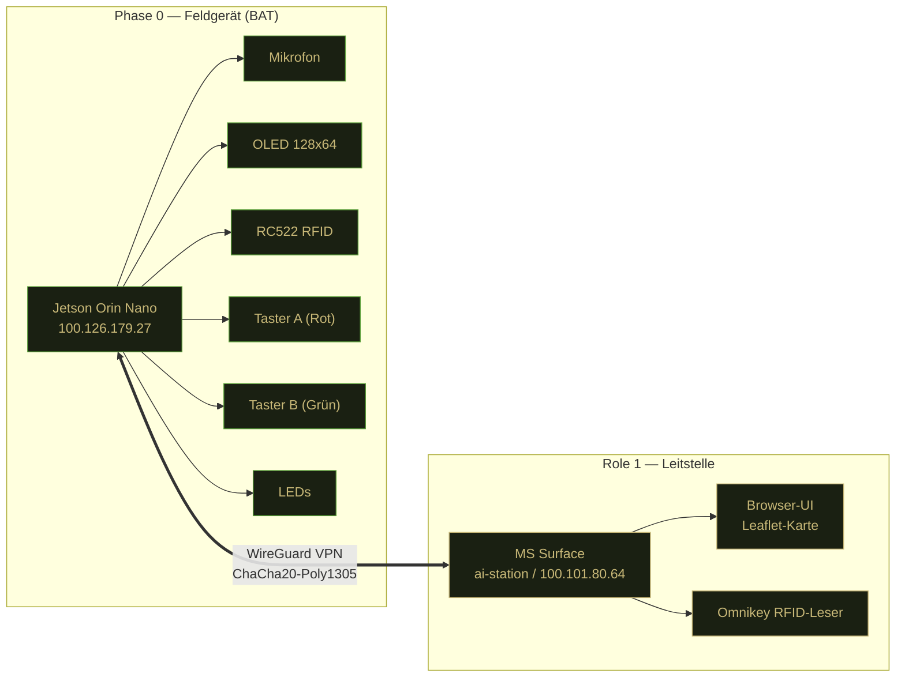
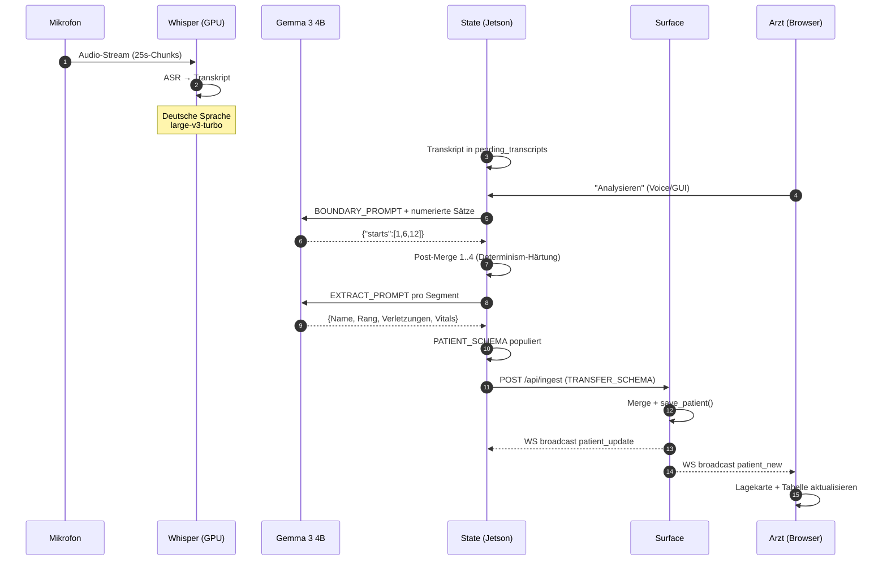
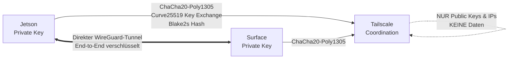
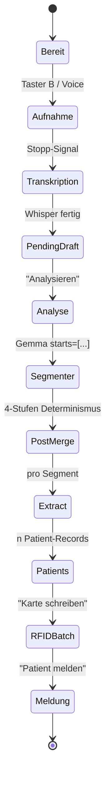
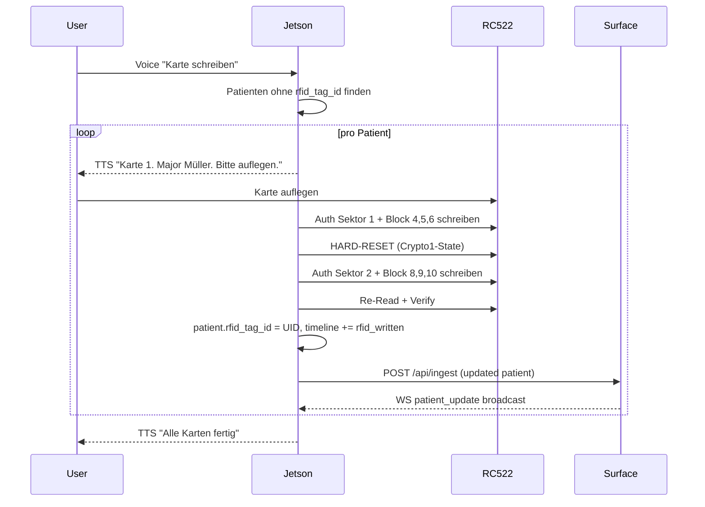

# SAFIR — Projekt-Dokumentation

**S**prachgestützte **A**ssistenz für **I**nformationserfassung in der **R**ettungskette

Version: 2.1 · Stand: April 2026 · Auftraggeber: CGI Deutschland · Zielgruppe: Bundeswehr Sanitätsdienst

---

## Inhaltsverzeichnis

1. [Executive Summary](#executive-summary)
2. [Architektur-Übersicht](#architektur-übersicht)
3. [Hardware](#hardware)
4. [Software-Stack](#software-stack)
5. [Datenmodell](#datenmodell)
6. [Sicherheitsarchitektur](#sicherheitsarchitektur)
7. [Workflows](#workflows)
8. [API-Referenz](#api-referenz)
9. [Konfiguration](#konfiguration)
10. [Deployment](#deployment)
11. [Performance & Limits](#performance--limits)
12. [Known Limitations & Roadmap](#known-limitations--roadmap)

---

## Executive Summary

SAFIR ist ein zweigeteiltes, netzbasiertes Dokumentationssystem für den Bundeswehr-Sanitätsdienst entlang der **Rettungskette** (Phase 0 bis Role 4). Ein **Feldgerät** (NVIDIA Jetson Orin Nano, getragen vom Sanitäter) nimmt Sprachdiktate auf, transkribiert sie lokal mit Whisper, segmentiert mehrere Patienten pro Diktat mittels Gemma 3 4B und schreibt eine eindeutige Patient-ID auf **MIFARE-Classic RFID-Karten**, die dem Verwundeten beigelegt werden. Alle extrahierten Patientendaten werden über ein **WireGuard-Mesh (Tailscale)** verschlüsselt an die **Leitstelle** (Microsoft Surface, Role 1) gespiegelt, wo ein Arzt auf einer taktischen Lagekarte die Triage setzt, Befunde bestätigt und den Transport koordiniert.

Das System läuft **vollständig offline** auf den Endgeräten — kein Cloud-Service, keine externe API. Alle KI-Modelle (Whisper large-v3-turbo, Gemma 3 4B, Vosk, Piper TTS) werden lokal ausgeführt.

**Kern-Differenzierung gegenüber bestehenden Lösungen:**

- **Edge-AI:** Modelle laufen auf dem 7.4-GB-Jetson — keine Abhängigkeit von Netzverbindung zur Cloud
- **Multi-Patient pro Diktat:** Ein ~10-minütiger freier Befund wird automatisch in strukturierte Patient-Records segmentiert
- **Physische Identifikation via RFID:** Verwundete gehen mit ihrer Karte entlang der Rettungskette — auf jeder Stufe kann die Karte gelesen werden
- **Halluzinations-Konservativ:** Das System ist so gebaut, dass es lieber einen Patienten vergisst als einen zu erfinden — kritisch für medizinische Dokumentation
- **Deutsche Sprachverarbeitung:** Whisper large-v3-turbo + Gemma 3 mit deutsch-spezifischen Post-Processing-Regeln

---

## Architektur-Übersicht

### Zwei-Geräte-Topologie



### Datenfluss — vom Sprachbefund zum Patientenrecord



### Layer-Stack pro Gerät

```
┌───────────────────────────────────────────────────────────┐
│ Jetson Orin Nano                                           │
├───────────────────────────────────────────────────────────┤
│ UI Layer     │ HTML Template (Jinja2) + Vanilla JS + WS   │
│ API Layer    │ FastAPI (uvicorn) auf Port 8080            │
│ Business     │ app.py — Segmenter, Extract, Sync, OLED    │
│ KI Layer     │ Whisper (GPU) · Gemma 3 (GPU) · Vosk (CPU)│
│              │ · Piper TTS (CPU)                          │
│ Hardware     │ RC522 (SPI) · OLED (I²C) · GPIO · LED     │
│ OS           │ NVIDIA JetPack 5.x (Ubuntu 20.04) + CUDA   │
└───────────────────────────────────────────────────────────┘

┌───────────────────────────────────────────────────────────┐
│ Microsoft Surface                                          │
├───────────────────────────────────────────────────────────┤
│ UI Layer     │ HTML Template (Jinja2) + Leaflet + WS      │
│ API Layer    │ FastAPI (uvicorn --reload) auf Port 8080   │
│ Business     │ backend/app.py — Aggregator, Omnikey-Lookup│
│ Integration  │ pyscard → HID Omnikey RFID-Reader          │
│ OS           │ Windows 11                                 │
└───────────────────────────────────────────────────────────┘
```

---

## Hardware

### Feldgerät: NVIDIA Jetson Orin Nano Super

| Komponente | Spezifikation |
|---|---|
| SoC | NVIDIA Orin · 6 ARM Cortex-A78AE @ 1.5 GHz · 1024 CUDA Cores (Ampere) · 32 Tensor Cores |
| Unified Memory | 7.4 GB LPDDR5 (shared CPU+GPU) |
| Storage | 256 GB NVMe SSD |
| Leistungsaufnahme | 7 W (idle) · 15 W (Volllast mit Whisper+Gemma) |
| Netzwerk | WiFi 6 + Ethernet Gigabit |
| Betrieb | Powerbank 20 000 mAh / 15 V / 65 W (~20 h Demo-Tag) |

**Peripherie:**

| Gerät | Interface | Funktion |
|---|---|---|
| OLED SSD1306 | I²C Bus 7 | 128×64 monochrom, 4 Info-Seiten |
| RC522 RFID | SPI | 13.56 MHz, MIFARE Classic 1K |
| 2 Taster | GPIO Pin 11 + 26 | Rot (A): OLED-Nav / Menü · Grün (B): Aufnahme |
| 3 LEDs | GPIO | Status / Aufnahme / Fehler |
| Mikrofon | USB | Freisprech-Mikro (configurable) |
| Audio-Out | USB + HDA | Parallel auf Headset + Lautsprecher |

### Leitstelle: Microsoft Surface

| Komponente | Spezifikation |
|---|---|
| CPU | Intel Core i7 (spezifisch je nach Modell) |
| GPU | NVIDIA RTX 4060 (8 GB VRAM) |
| RAM | 16 GB |
| OS | Windows 11 |
| Netzwerk | WiFi + Tailscale VPN |

**Peripherie:**

| Gerät | Interface | Funktion |
|---|---|---|
| HID Omnikey RFID-Leser | USB | Desktop-Kartenleser für Patient-Aufruf |

### RFID-Karten

| Eigenschaft | Wert |
|---|---|
| Typ | MIFARE Classic 1K |
| Frequenz | 13.56 MHz (HF) |
| Speicher | 1024 Byte in 16 Sektoren à 4 Blöcke à 16 Byte |
| Verschlüsselung | Crypto1 (MIFARE-Standard) |
| Lebensdauer | 100 000 Schreibvorgänge |

**SAFIR-Belegung:**

```
Block 0      │ Manufacturer-Block (read-only) — UID des Chips
Block 1-3    │ (reserviert) Sektor-0 Trailer mit Keys
Block 4      │ SAFIR Magic-Bytes + Version + Zeitstempel
Block 5      │ Patient-ID (16 Byte ASCII)
Block 6      │ Triage, Alter, Geschlecht, Blutdruck, Puls, Atmung, SpO2, GCS
Block 7      │ Sektor-1 Trailer (Keys) — nicht von SAFIR geschrieben
Block 8-9    │ Name (32 Byte UTF-8)
Block 10     │ Rang (reserviert für zukünftige Version)
Block 11     │ Sektor-2 Trailer (Keys) — nicht von SAFIR geschrieben
Block 12-63  │ Reserviert für künftige Erweiterungen
```

---

## Software-Stack

### KI-Modelle

| Modell | Typ | Größe | Hardware | Zweck |
|---|---|---|---|---|
| Whisper large-v3-turbo | ASR (whisper.cpp) | ~1.2 GB RSS | Jetson GPU | Echtzeit-Transkription (Deutsch) |
| Gemma 3 4B | LLM (Q4_K_M via Ollama) | ~4.3 GB VRAM | Jetson GPU | Segmentierung + Feld-Extraktion |
| Vosk (de-klein) | Command-ASR | ~80 MB | Jetson CPU | Offline-Sprachbefehle (~15 ms Latenz) |
| Piper | TTS (Neural) | ~65 MB je Stimme | Jetson CPU | Deutsche Sprachausgabe |

### Python-Dependencies

**Jetson (`requirements.txt`):**
- `fastapi` + `uvicorn` — Web-Framework
- `whisper-cpp-python` — Whisper-Bindings
- `ollama` — LLM-Client
- `vosk` — Command-Recognition
- `piper-tts` — TTS
- `sounddevice`, `numpy`, `wave` — Audio I/O
- `python-docx` — DOCX-Export
- `reportlab` — PDF-Export
- `httpx` — HTTP-Client für Surface-Sync
- `websockets` — WebSocket-Live-Sync
- Custom: `shared/rfid.py`, `jetson/hardware.py`, `jetson/oled.py`

**Surface (`backend/requirements.txt`):**
- `fastapi` + `uvicorn` — gleiches Web-Framework
- `pyscard` — Omnikey-RFID-Zugang
- `httpx` — HTTP-Client

### Betriebssystem-Integration

**Jetson:**
- systemd-Unit `safir.service` für Auto-Start
- Headless-Mode via `systemctl set-default multi-user.target` (~800 MB RAM freier als mit GUI)
- `safir-start.sh` regelt Startreihenfolge (Ollama zuerst, dann Whisper, dann FastAPI)

**Surface:**
- `backend/start-surface.cmd` startet uvicorn mit `--reload` (File-Watcher, Auto-Restart bei Code-Änderungen)

---

## Datenmodell

### PATIENT_SCHEMA

Das zentrale Datenmodell jedes Patienten. Definiert in `shared/models.py:67`.

```python
{
    # Identifikation
    "patient_id": "PAT-XXXXXXXX",           # Eindeutige ID (Hex)
    "timestamp_created": ISO-8601,
    "timestamp_updated": ISO-8601,
    "current_role": "phase0" | "role1" | ...,
    "flow_status": "registered" | "inbound" | "arrived" | ...,
    "synced": bool,                          # Jetson→Surface übertragen
    "analyzed": bool,                        # LLM-Extraktion durchlaufen
    "rfid_tag_id": "...",                    # MIFARE-UID, leer wenn keine Karte
    "device_id": "jetson-01",
    "created_by": "OFA Hugendubel",

    # Stammdaten
    "name": "Erika Schmidt",
    "rank": "Hauptfeldwebel",
    "unit": "3./SanRgt 1",
    "nationality": "DE",
    "dob": "1990-05-20",
    "blood_type": "0+",
    "allergies": "",

    # Medizin
    "triage": "T1" | "T2" | "T3" | "T4" | "",
    "injuries": ["leichte Kopfverletzung", ...],
    "mechanism": "Schussverletzung",
    "medications": [...],
    "treatments": [...],

    "vitals": {
        "pulse": 110,
        "bp": "120/80",
        "resp_rate": 18,
        "spo2": 94,
        "gcs": 15,
        "temp": 37.2,
    },

    # 9-Liner MEDEVAC (optional)
    "template_type": "" | "9liner",
    "nine_liner": {
        "line1": "UTM-Grid",
        "line2": "Funkfrequenz",
        ...
        "line9": "NBC-Kontamination",
    },

    # Kontext
    "transcripts": [{"time": ISO, "text": "..."}, ...],
    "timeline": [{"time": ISO, "event": "registered", "details": "..."}, ...],
    "confidences": {                         # Feld-Level-Konfidenz (0-1)
        "name": 0.95,
        "rank": 0.92,
        "vitals": {"pulse": 0.89, "spo2": 0.85, ...},
        ...
    },
}
```

### TRANSFER_SCHEMA

Wrapper für Jetson→Surface-Übertragung. Enthält Metadaten über das sendende Gerät plus den kompletten Patient-Record.

```python
{
    "source_device": "jetson",
    "device_id": "jetson-01",
    "unit_name": "BAT Alpha42",
    "timestamp": ISO-8601,
    "patient": {...},                        # PATIENT_SCHEMA
    "flow_status": "arrived",
    "rfid_tag_id": "...",
}
```

### Patient-Flow-States

```
registered  → analyzed  → synced  → arrived  → in_treatment  → stabilized  → outbound  → transferred
(erstellt)   (LLM fertig) (Role 1)  (Role 1)    (behandelt)     (stabil)     (Transport) (Role 2)
```

---

## Sicherheitsarchitektur

### Verschlüsselte Kommunikation

Beide Geräte kommunizieren ausschließlich über das **Tailscale-Mesh**, das **WireGuard** als VPN-Protokoll nutzt.



**Kryptographische Primitive (WireGuard-Standard):**

| Funktion | Algorithmus | Bit-Länge |
|---|---|---|
| Key Exchange | Curve25519 ECDH | 256 |
| Symmetrische Verschlüsselung | ChaCha20 | 256 |
| Authentifizierte Verschlüsselung | Poly1305 | 128 |
| Hash / MAC | Blake2s | 256 |

**Was Tailscale NICHT sieht:**

- Payload-Inhalte (end-to-end verschlüsselt zwischen Jetson und Surface)
- Patient-Daten, Transkripte, Audio-Samples
- Nur Peer-IPs und Public Keys zur Verbindungsherstellung

### RFID-Karten-Sicherheit

MIFARE Classic Crypto1 ist **nicht kryptographisch sicher** (1994er Technologie, in 2007 per Brute-Force geknackt). SAFIR behandelt daher die RFID-Karte als **reine ID-Referenz**, nicht als Container für sensitive Daten:

- **Auf der Karte:** Patient-ID (Hex) + Basisdaten (Name, Triage, Vitals) für Offline-Lesbarkeit
- **NICHT auf der Karte:** Transkripte, freitextliche Verletzungen, 9-Liner-Details, Operator-Namen
- Die **Wahrheits-Quelle** liegt im verschlüsselten Backend-Store, die Karte ist nur ein "ID-Stempel"

Für eine Produktions-Lösung mit TEMPEST/EmSec-Anforderungen sind passive UHF-Tags mit Shielding-Tasche denkbar — das ist **nicht im MVP-Scope** aber im Vision-Page dokumentiert.

### Authentifizierung / Autorisierung

**Operator-Login via RFID:**
- Jeder Sanitäter hat eine persönliche Operator-Karte, UID ist in `config.json → rfid.operators` eingetragen
- Auflegen der Karte → `current_operator` wird gesetzt → TTS „Willkommen, [Rang] [Name]"
- Sperren nach X Minuten Inaktivität (`security.lock_idle_seconds`, Default 1800)

**Rollen-System (`config.json → rfid.roles`):**

| Rolle | Erlaubnisse |
|---|---|
| `bat_soldat_1` | patient_create · patient_update · rfid_write_patient |
| `arzt` | + patient_delete · rfid_overwrite_patient |

**Was nicht drin ist:**
- Zentralisiertes Identity-Management (LDAP, OAuth) — außerhalb des MVP-Scope
- Multi-Factor-Authentication — Tailscale + RFID als Kombination reicht für die Demo
- Audit-Logs mit Hash-Chains — Timeline-Events dokumentieren Aktionen, aber nicht manipulationssicher

---

## Workflows

### Multi-Patient-Diktat



### Post-Merge-Strategie (4-stufig)

LLMs sind nicht-deterministisch — selbst mit `temperature=0.0` können Kante-Cases inkonsistent sein. Wir härten das Segmenter-Ergebnis mit vier aufeinanderfolgenden Deterministischen Regeln:

1. **Post-Merge 1** — sehr kurze Segmente (< 30 chars) werden mit dem vorherigen vereint
2. **Post-Merge 2** — Pronomen-Segmente am Anfang ("Er hat...", "Sie ist...") gehören zum vorherigen Patient
3. **Post-Merge 3** — Segmente ohne `START_MARKER` und ohne `PATIENT_MARKER` werden mit dem vorherigen zusammengelegt (dies fängt die "Wir müssten..."-Fälle ab)
4. **Post-Merge 4** — Intro-Filter: Einleitungssätze wie "Hier spricht..." die als eigenständiger Patient erkannt wurden, werden mit dem folgenden echten Patient vereint

Details und Code siehe `docs/SCIENTIFIC.md`.

### RFID-Schreib-Batch



**Warum Hard-Reset zwischen Sektor 1 und 2?** Der RC522-Chip behält nach Sektor-1-Auth einen Crypto1-State, der eine neue Sektor-2-Auth silent fehlschlagen lässt. `_rc522_stop_crypto()` + `_rc522_halt()` + `rc522_init()` + neuer Anticoll+Select ist erforderlich. Siehe `shared/rfid.py:599-649`.

### Bidirektionaler Live-Sync

- **Outgoing:** Jetson pusht via HTTP `POST /api/ingest` pro Patient oder Batch via Voice „Patient melden"
- **Incoming:** Jetson hält **persistenten WebSocket-Client** offen zum Surface (`ws://surface/ws`). Jede Surface-Änderung (Triage, Status, neuer Patient von anderem BAT) kommt als `patient_update`-Event herein und wird in `state.patients` gemerged

---

## API-Referenz

### Jetson (Port 8080)

**Datenabfrage:**
- `GET /api/status` — System-Status, Modelle, Memory
- `GET /api/patients` — alle Patient-Records
- `GET /api/pending` — unanalysierte Transkripte
- `GET /api/templates` — verfügbare Dokument-Templates

**Aufnahme + Analyse:**
- `POST /api/recording/start` — Diktat-Session starten
- `POST /api/recording/stop` — Diktat beenden (→ pending_transcript)
- `POST /api/analyze/pending` — LLM-Analyse auslösen

**RFID:**
- `POST /api/rfid/batch` — Batch-Write für alle unmarkierten Patienten
- `POST /api/rfid/cancel` — laufenden Batch-Write abbrechen
- `POST /api/rfid/erase` — eine einzelne Karte löschen
- `POST /api/rfid/scan` — manueller UID-Lookup

**Sync:**
- `POST /api/sync/all` — alle analyzed+!synced Patienten an Surface melden
- WebSocket `/ws` — Live-Events

**Konfiguration:**
- `GET /api/config` — komplette Config
- `POST /api/config/voice-commands` — Voice-Trigger editieren
- `GET /api/config/navigation` — Sidebar-Struktur

### Surface (Port 8080)

**Datenempfang:**
- `POST /api/ingest` — Patient von Jetson empfangen (oder Update)
- `POST /api/position` — BAT-Positions-Update
- `POST /api/rfid/clear-tag` — RFID-Zuordnung auflösen (nach Erase am Jetson)

**Datenabfrage:**
- `GET /api/patients` — aggregierte Patient-DB
- `GET /api/status` — Surface-Status + Triage-Counts

**RFID:**
- `POST /api/rfid/lookup` — manueller UID-Lookup (Fallback für Omnikey-Problem)

---

## Konfiguration

Die Konfiguration erfolgt über `config.json` auf jedem Gerät. Änderungen sind live über die Settings-UI editierbar, keine Code-Änderung nötig.

### Kern-Bereiche

```json
{
    "ollama": {
        "url": "http://127.0.0.1:11434",
        "model": "gemma3:4b",
        "num_ctx": 2048,
        "num_gpu": -1,
        "keep_alive": -1
    },
    "backend": {
        "url": "http://100.101.80.64:8080"
    },
    "voice_commands": {
        "record_start": {"triggers": ["aufnahme starten", ...]},
        "rfid_write_patient": {"triggers": ["karte schreiben", ...]},
        ...
    },
    "rfid": {
        "operators": [
            {"uid": "8AEF10C3", "name": "OFA Hugendubel", "role": "arzt"}
        ],
        "roles": {...}
    },
    "navigation": [
        {"id": "home", "label": "Start", "icon": "..."},
        ...
    ],
    "security": {
        "lock_idle_seconds": 1800
    },
    "device_id": "jetson-01",
    "unit_name": "BAT Alpha42",
    "default_medic": "OFA Hugendubel",
    "rescue_station": {
        "lat": 50.7374,
        "lon": 7.0982,
        "name": "Bonn-Hardthöhe"
    }
}
```

---

## Deployment

### Jetson

1. **JetPack 5.x installieren** (Ubuntu 20.04 + CUDA 12.6)
2. **Headless-Mode aktivieren:** `sudo systemctl set-default multi-user.target`
3. **Repository klonen:** `git clone git@github.com:Ajintaro/SAFIR.git /home/jetson/cgi-afcea-san`
4. **Python-Venv + Deps:** `python -m venv venv && . venv/bin/activate && pip install -r requirements.txt`
5. **Modelle laden:**
   - Whisper: `whisper.cpp`-Download gemäß `scripts/install-whisper.sh`
   - Ollama: `curl https://ollama.ai/install.sh | sh && ollama pull gemma3:4b`
   - Vosk: Deutsches Klein-Modell in `models/vosk-model-de-0.21/`
   - Piper: Thorsten-high + Kerstin-low in `models/piper/`
6. **Systemd-Service:** `sudo systemctl enable safir.service`
7. **Tailscale:** `sudo tailscale up --ssh`

### Surface

1. **Python 3.11+ installieren**
2. **Repository klonen**
3. **Venv + Deps:** `python -m venv venv && venv\Scripts\activate && pip install -r backend/requirements.txt`
4. **Tailscale installieren** und mit Jetson im selben Netz verbinden
5. **Start:** `backend\start-surface.cmd` (nutzt uvicorn mit `--reload`)
6. **Browser:** `http://localhost:8080`

Details: `backend/SETUP-SURFACE.md`

---

## Performance & Limits

### Latenz-Budget

| Stufe | Typische Dauer | Max |
|---|---|---|
| Whisper-Transkription (pro 25-s-Chunk) | 3–5 s | 8 s |
| Gemma Boundary-Segmentation (Prompt) | 5–8 s | 12 s |
| Gemma Extract (pro Patient) | 10–20 s | 40 s |
| End-to-End (1 Patient, 30 s Diktat → Record) | ~30 s | ~60 s |
| Jetson→Surface Sync | < 1 s | 3 s |
| Omnikey RFID-Scan → Modal | < 2 s | 3 s |

### Ressourcen-Nutzung

**Jetson Unified Memory (7.4 GB):**

| Mode | Whisper | Gemma 3 4B | Frei |
|---|---|---|---|
| Idle | 0 | 0 | 7.4 GB |
| Recording (Whisper lädt) | 1.2 GB | 0 | 6.2 GB |
| Transcription | 1.2 GB | 0 | 6.2 GB |
| **Analyse (Swap-Mode)** | 0 (unloaded) | 4.3 GB | 3.1 GB |
| Analyse fertig | 0 | 0 | 7.4 GB |

**Swap-Mode:** Vor der Analyse wird Whisper aus dem VRAM entladen, Gemma geladen. Nach der Analyse umgekehrt. So passen beide nicht gleichzeitig, aber es gibt immer nur einen aktiven Use-Case (Diktieren ODER Analysieren).

### Skalierungs-Grenzen

- **Patienten pro BAT-Session:** bis zu ~50 (UI + DB unproblematisch), praxisnah 5–15 pro Diktat
- **Diktat-Länge:** 10 Minuten (600 s) Maximum, dann wird Whisper-Kontext groß
- **Anzahl BATs pro Surface:** 10+ getestet, kein theoretisches Limit
- **Gleichzeitige Pushes:** Surface behandelt ~50 Req/s unproblematisch

---

## Known Limitations & Roadmap

### Kritische Limitierungen

| Limit | Impact | Workaround / Geplant |
|---|---|---|
| Einzel-Patient-Diktat wird bei konversationellen Unterbrechungen übersehen | Arzt muss manuell nachlegen | Prompt-Beispiel mit unterbrochener Rede ergänzen; Confidence-Threshold für Manual-Review |
| MIFARE Classic nicht kryptographisch sicher | Daten auf Karte mitlesbar | Daten auf Karte minimal halten; sensitive Daten nur verschlüsselt im Backend |
| Gemma 3 4B kann nicht Triage setzen | Arzt MUSS manuell triagieren | Beabsichtigt — siehe Philosophie-Doku |
| Kein zentralisierter Identity-Provider | User-Management manuell in JSON | Geplant für v3.x — LDAP-Integration |
| Kein verschlüsselter Offline-Store auf der Karte | Kartenverlust = Datenleck | Pro Karte Mini-Key-Derivation planbar (v3) |

### Roadmap

**v2.2 (Demo-Hardening):**
- A1–A5 Messe-Hardening (Prompt-Injection, Vital-Validation, Content-Filter, Rate-Limit, Length-Extreme)
- B1 Confidence-Badges pro Feld ✓
- B4 Preset-Demo-Szenarien ✓
- C1 Philosophie-Page ✓
- D1 Backup-Jetson für Live-Demo
- D4 Demo-Day-Playbook

**v3.0 (Post-AFCEA):**
- 9-Liner MEDEVAC Full-Flow inkl. NATO-Tester
- TCCC-Card digitalisiert
- Multi-Station-Setup (Role 2 + 3 Dashboards)
- PostgreSQL statt JSON-Persistenz
- Voice-Biometrie für Sanitäter-Login (ohne RFID)

**v4.0 (Vision):**
- Integration mit SitaWare / NATO NIFC
- SATCOM-Modus für isolierte Einsätze
- LLM-Fine-Tuning auf bundeswehrspezifische Terminologie
- Cross-Border-Interoperabilität (DE/NL/FR Health-Templates)

---

## Anhang

### Links

- Repository: `github.com/Ajintaro/SAFIR`
- In-App-Handbuch: `http://localhost:8080/#handbook`
- Wissenschaftliche Doku: `docs/SCIENTIFIC.md`
- Messe-One-Pager: `docs/safir-onepager.html`

### Kontakt

CGI Deutschland · AFCEA-Messe 2026

### Lizenzen

SAFIR-Code: © CGI Deutschland, Bundeswehr-internal use
- Whisper: MIT License (OpenAI)
- Gemma 3: Apache 2.0 (Google)
- Vosk: Apache 2.0 (Alpha Cephei)
- Piper: MIT License (Rhasspy)
- Tailscale: BSD 3-Clause
